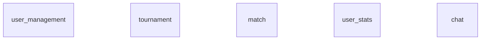

# Backend as Microservices

## Structure



## Databases

## How to add a microservice ?

```shell
mkdir <microservice_name> && cd <microservice_name>
mkdir app src && touch docker-compose.yml
mkdir app/django app/nginx app/postgres
touch app/django/Dockerfile app/nginx/Dockerfile app/nginx/nginx.conf app/postgres/Dockerfile app/postgres/init.sql
```